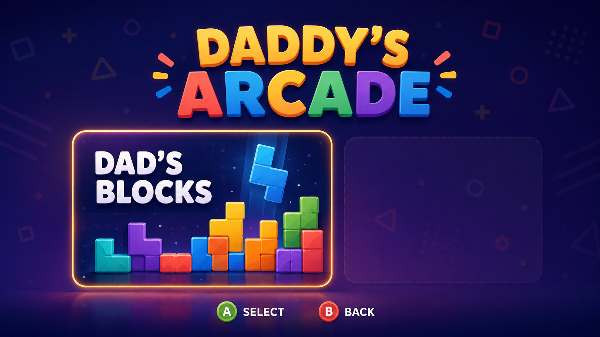

# Daddy's Arcade

> **Home Menu concept** — visual direction for the first playable milestone,
> not final production artwork. The application opens here, with Dad's Blocks
> as the first and only playable game.

Daddy's Arcade is a family game project: a small collection of original,
kid-friendly games inspired by the clear rules and immediate fun of classic
arcade games.

The first game is **Dad's Blocks**, a falling-block puzzle game. It may draw on
the general idea of arranging falling geometric pieces, but it will not use the
Tetris name, branding, artwork, music, level designs, or distinctive visual
presentation.

The application opens on the **Daddy's Arcade Home Menu**, not directly inside
Dad's Blocks. The first release has one playable game tile, while the shell is
structured to welcome additional original games later without being overbuilt
today.

## Project status

The project is in its documentation and technical-validation phase. No game
engine has been committed to the repository yet.

The current recommendation is **Unity 6 LTS with C#**, subject to an explicit
engine decision. The deciding factor is the long-term Xbox path, not the small
amount of code needed for the first 2D game.

## Intended development loop

1. Design, code, run, and test on macOS.
2. Test keyboard and Xbox-controller input on macOS.
3. Keep gameplay rules independent of platform APIs and presentation code.
4. Use the Windows machine only when Windows or Xbox tooling is required.
5. Validate a small deployable build before investing in Xbox automation.
6. After the pipeline is proven, package and deploy to Xbox over the local
   network.

See [docs/product.md](docs/product.md),
[docs/architecture.md](docs/architecture.md), and
[docs/xbox-development.md](docs/xbox-development.md) for the working plan.

## First playable milestone

Daddy's Arcade should open locally on macOS to a controller-friendly Home Menu.
Selecting Dad's Blocks starts the game, and leaving the game returns to the Home
Menu without restarting the application. Dad's Blocks uses placeholder geometry
and supports:

- a playfield and falling piece set;
- spawning and gravity;
- left/right movement and rotation;
- collision, locking, and line clearing;
- game over and restart;
- basic scoring and pause;
- keyboard and Xbox controller input;
- automated tests for the platform-independent rules.

Kid Mode, Dad Mode, polished art and audio, multiplayer, and the other arcade
games are intentionally later milestones. The launcher/Home Menu itself is part
of the first milestone.

## Repository principles

- Prefer short feedback loops and small, meaningful commits.
- Keep the rule engine deterministic and testable without launching the editor.
- Translate devices into gameplay actions at the edge of the application.
- Keep Xbox-only APIs behind platform adapters.
- Do not claim that an Xbox build or deploy command works until it has been
  tested against the real Windows toolchain and console.
- Create original names, art, audio, UI, and game expression.

## Documents

- [Product brief](docs/product.md)
- [Architecture](docs/architecture.md)
- [Arcade shell and Home Menu](docs/milestones/00-arcade-shell.md)
- [First milestone](docs/milestones/01-dads-blocks-local.md)
- [Xbox development notes](docs/xbox-development.md)
- [Engine decision record](docs/decisions/0001-game-engine.md)
